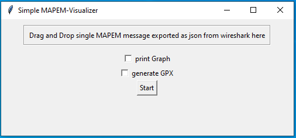

Simple Mapem Visualization Tool
===============================

This tool allows to get a quick overview of a V2X MAPEM.

Within the Graphical User Interface drag and drop a single Export from Wireshark of one Map to the Drag and Drop Area
If you are not seeing all the lanes in your Output you are probably missing another wireshark frame. Check if there are two MAPEM messages transmitted at almost the same time, in this case these should belong together.
Export both of it and use the single json file (with an array of two messages) as Import for the tool.

By selecting "print Graph" a Quick Overview will be provided for the inserted MAPEM, "gernerate GPX" will create a corresponing .gpx file for the json MAPEM and save it to the same directory. This file can be used to get a more detailed idea of the crossing, by inserting it in an online modelling tool for gpx files, like this [GPX-Visualizer](https://www.gpsvisualizer.com/). To see the satelite image you need to change the Mapoption in the top right corner to "ArcGIS hybrid""
Both actions can be performed simultaniously.
